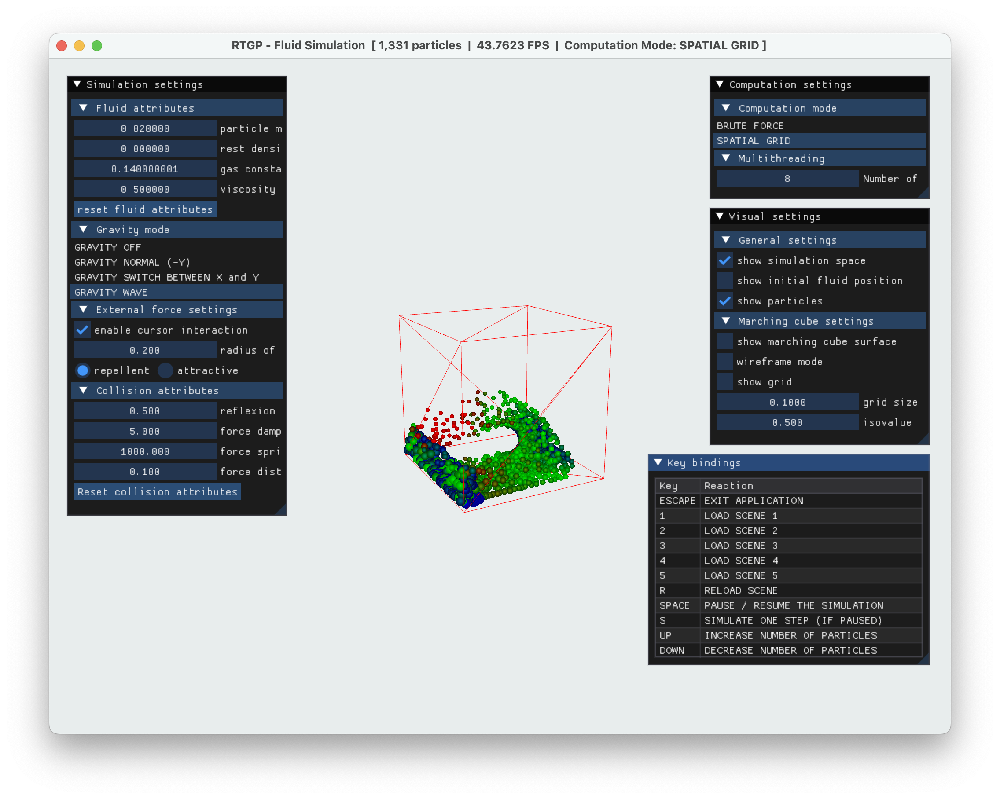

# rtgp-fluid-simulation
Real-time fluid simulation made in C++ using OpenGL for the course ["Real-Time Graphics Programming"](https://www.unimi.it/en/education/degree-programme-courses/2023/real-time-graphics-programming) at the [Università degli Studi di Milano Statale](https://www.unimi.it/en).



## Features
* Real-time fluid simulation using the Smoothed Particles Hydrodynamics method (SPH).
* Implemented using a spatial grid and multithreading with dynamic spatial partitioning.
* Graphical user interface for changing the fluids and simulations parameters.
* Mouse cursor interaction with particles (apply external force).
* Fluid rendering using the Marching Cubes algorithm.

## Benchmarking
to do: graph with different numbers of particles and fps, compare brute force to spatial grid

## Dependencies

* Graphics Library Framework GLFW Version 3 (glfw3)  
* OpenGL Extension Wrangler Library (GLEW)  
* OpenGL Mathematics (GLM)

Install the dependencies by following the installation instructions on the respective websites (listed below) or by using vcpkg or your package-manager (e.g. homebrew or APT).

### Graphics Library Framework GLFW Version 3 (glfw3)
GLFW is an Open Source, multi-platform library for OpenGL, OpenGL ES and Vulkan development on the desktop. It provides a simple API for creating windows, contexts and surfaces, receiving input and events.  
Click [here](https://www.glfw.org/) for more informations.

### OpenGL Extension Wrangler Library (GLEW)
The OpenGL Extension Wrangler Library (GLEW) is a cross-platform open-source C/C++ extension loading library. GLEW provides efficient run-time mechanisms for determining which OpenGL extensions are supported on the target platform.  
Click [here](https://glew.sourceforge.net/) for more informations.

### OpenGL Mathematics (GLM)
OpenGL Mathematics (GLM) is a header only C++ mathematics library for graphics software based on the OpenGL Shading Language (GLSL) specifications.  
Click [here](https://github.com/g-truc/glm) for more informations.

### Further notes.
This project uses [Dear ImGui](https://github.com/ocornut/imgui). There is no need for installing, the source files are included in this repository.  

## Installation and Usage

Clone the repository.  

```
$ git clone https://github.com/startbit96/rtgp-fluid-simulation.git
```

Change into the directory of the repository and install it using cmake.

```
$ cd rtgp-fluid-simulation  
$ mkdir build  
$ cd build  
$ cmake ..  
$ make  
```

Run the application with `./rtgp_fluid_simulation` within the build directory.  
Note that because of relative paths for loading the shaders, you cannot run the program from within the repositories main directory.  

If an error occurs while installing the application, make sure, that you have installed all the mentioned dependencies.  
### Key Bindings
The fluids parameters and some simulation settings can be adapted using the graphical user interface.  
Further interaction is possible through the keyboard as listed in the key binding list below.  

| Key | Description |
| :---: | :---: |
| `ESCAPE` | exit application |
| `1` | load scene 1 |
| `2` | load scene 2 |
| `3` | load scene 3 |
| `4` | load scene 4 |
| `5` | load scene 5 |
| `R` | reload scene |
| `SPACE` | pause / resume the simulation |
| `UP` | increase number of particles |
| `DOWN` | decrease number of particles |

### Implemented Scenes

| Scene ID | Description |
| :---: | :---: |
| `1` | cube in the middle |
| `2` | cube in the middle (big simulation space) |
| `3` | dam break scenario |
| `4` | double dam break scenario |
| `5` | drop fall scenario |

## References
The used method for the fluid simulation is based on the paper ["Particle-based fluid simulation for interactive applications" from Mueller et al.](https://dl.acm.org/doi/10.5555/846276.846298) from 2003.  

The OpenGL related code is based on the [YouTube OpenGL-tutorial of The Cherno](https://www.youtube.com/playlist?list=PLlrATfBNZ98foTJPJ_Ev03o2oq3-GGOS2) and on the lab-lessons of the "Real-Time Graphics Programming Course".